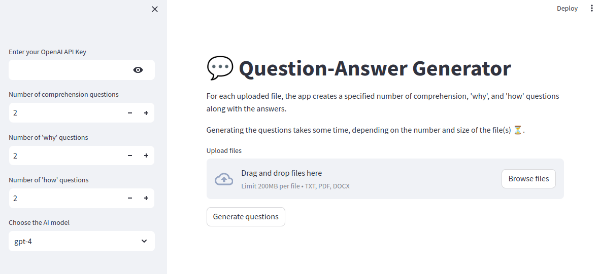

# Question-Answer Generator
For each uploaded file, the streamlit app creates a specified number of comprehension, 'why', and 'how' questions along with the answers.


## Demo

<p align="center">


<p align="center">


## Description


This project is a Python-based streamlit implementation that utilizes OpenAI's GPT models to create questions and answers, extracting information from text files.

## Installation

### Prerequisites

* Python 3.6 or higher
* virtualenv

### Setup

1. Clone the repository:

```bash
git clone https://github.com/kssmagister/kss-question-answer-generator.git
```

2. Navigate to the project directory:

```bash
cd kss-question-answer-generator
```

3. Create a virtual environment:

```bash
python3 -m venv venv
```

4. Activate the virtual environment:

- on Linux and macOS run:
```bash
source venv/bin/activate
```
- on Windows run:
```bash
source venv\Scripts\activate
```

5. Install the required packages:

```bash
pip install -r requirements.txt
```

## Usage

1. Make sure your virtual environment is active:
- on Linux and macOS run:
```bash
source venv/bin/activate
```
- on Windows run:
```bash
source venv\Scripts\activate
```

2. Run the `app.py` script:

```bash
streamlit run app.py
```

3. Stop the `app.py` script:

```bash
Ctrl+C
```

The assistant will process the queries provided in the `app.py` file and download the results in a text file.


## Acknowledgments

* OpenAI for creating the GPT language model
* The `langchain` library for providing a convenient way to interact with language models
